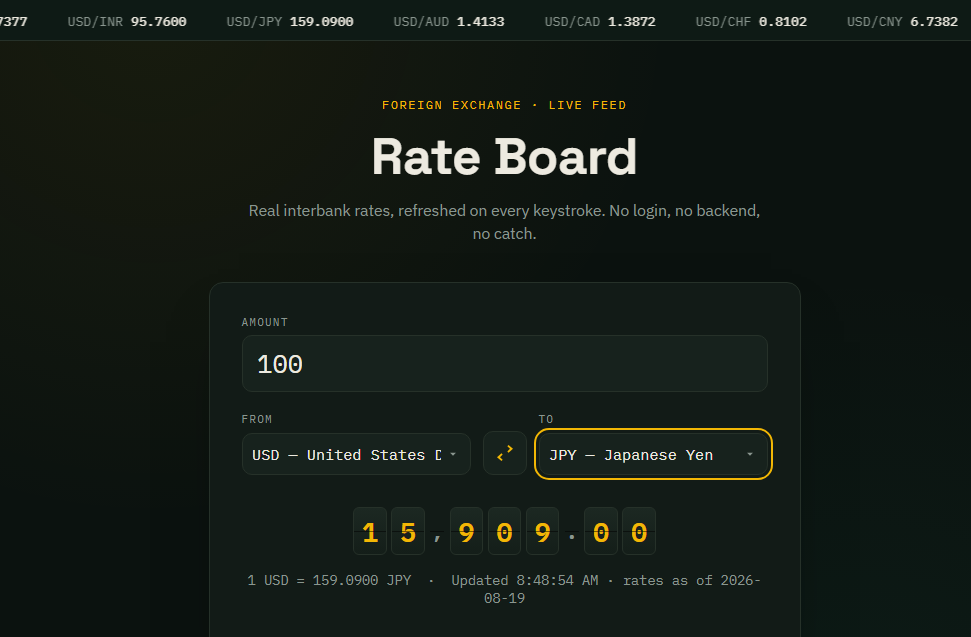

# Rate Board — Live Currency Converter

A currency converter that pulls real exchange rates from a free public API. No backend, no database, no login — open `index.html` and it works.

**[Live demo →](#)** *(add your GitHub Pages link here after deploying)*



## Features

- Live exchange rates for 30+ currencies, sourced from the European Central Bank via the [Frankfurter API](https://frankfurter.dev)
- Convert as you type, with debounced requests so it doesn't spam the API
- Scrolling ticker strip showing USD rates against major currencies, auto-refreshing every 60 seconds
- Split-flap "departures board" digit display for the converted amount
- Swap-currencies button, keyboard accessible throughout
- Graceful error handling if the API is unreachable
- Fully responsive, dark-mode-only exchange-terminal aesthetic
- Zero dependencies — vanilla HTML, CSS, and JavaScript

## Why no backend?

The [Frankfurter API](https://frankfurter.dev) is free, requires no API key, and supports CORS — so the browser can call it directly. That means this project is 100% static and deploys anywhere that serves plain files (GitHub Pages, Netlify, Vercel, or just a local folder).

## Run it locally

Clone the repo and open `index.html` in a browser. That's it — no build step, no `npm install`.

```bash
git clone https://github.com/<your-username>/rate-board.git
cd rate-board
open index.html   # or just double-click it
```

If your browser blocks `fetch` on the `file://` protocol, serve it with any static server instead:

```bash
python3 -m http.server 8000
# then visit http://localhost:8000
```

## Deploy to GitHub Pages

1. Push this repo to GitHub.
2. Go to **Settings → Pages**.
3. Under **Build and deployment**, set **Source** to `Deploy from a branch`, pick `main` and `/ (root)`.
4. Save — your app will be live at `https://<your-username>.github.io/<repo-name>/` within a minute or two.

## Project structure

```
rate-board/
├── index.html    # markup
├── style.css     # exchange-terminal styling, split-flap display, ticker marquee
├── script.js     # fetch logic, conversion, ticker, and rendering
└── README.md
```

## Data source

Rates are provided by [Frankfurter](https://frankfurter.dev), which republishes official European Central Bank reference rates. Rates update once per business day around 16:00 CET — it's not a live trading feed, but it's accurate for everyday conversion, invoicing, and display use.

## License

MIT — use this however you'd like.
